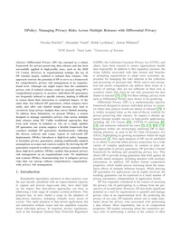

<br />

<div align="center">
  <a href="https://pps-lab.com/">
    
  </a>

  <h3 align="center">DPolicy: Managing Privacy Risks Across Multiple Releases with Differential Privacy</h3>

  <p align="center">
    <b>This repository contains the artifact for the IEEE S&P 2025 paper:</b>
  </p>


  N. Küchler, A. Viand, H. Lycklama, and A. Hithnawi,
  "DPolicy: Managing Privacy Risks Across Multiple Releases with Differential Privacy" <br>
in 2025 IEEE Symposium on Security and Privacy (SP), San Francisco, CA, USA, 2025

  <div align="left">
  <details>
<summary>
Bibtex
</summary>


```
@INPROCEEDINGS {Kuchler2025-dpolicy,
    author = {Küchler, Nicolas and Viand, Alexander and Lycklama, Hidde and Hithnawi, Anwar},
    booktitle = {2025 IEEE Symposium on Security and Privacy (SP)},
    title = {DPolicy: Managing Privacy Risks Across Multiple Releases with Differential Privacy},
    year = {2025},
    volume = {},
    publisher = {IEEE Computer Society},
    address = {Los Alamitos, CA, USA},
    month = {may}
}
```


</details>
</div>
</div>


**🚧 Coming Soon! 🚧**:  The source code will be made available here shortly.