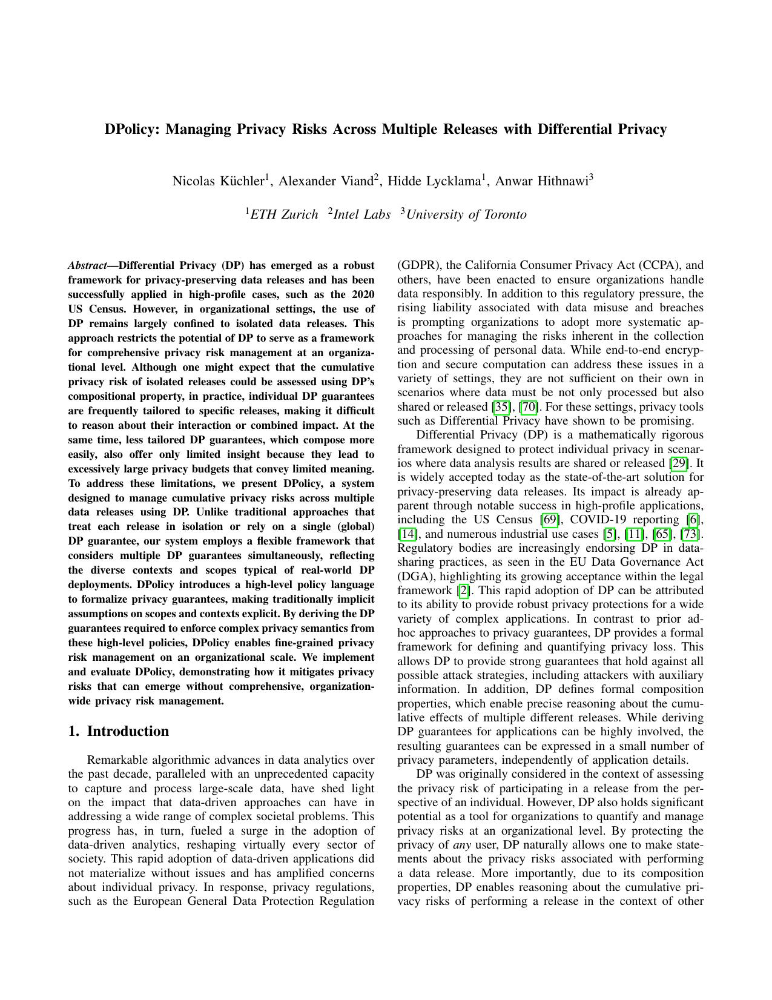

<!-- TODO: ADD WHEN AVAILABLE -->
[![ArXiv][arxiv-shield]][arxiv-url]
<!-- [![IEEE][ieee-shield]][ieee-url] -->


<!-- PROJECT LOGO -->
<br />

<div align="center">
  <a href="http://arxiv.org/abs/2505.06747.pdf">
    
  </a>

  <h3 align="center">DPolicy: Managing Privacy Risks Across Multiple Releases with Differential Privacy</h3>

  <p align="center">
    <b>This repository contains the artifact for the IEEE S&P 2025 paper:</b>
  </p>


  N. Küchler, A. Viand, H. Lycklama, and A. Hithnawi,
  "DPolicy: Managing Privacy Risks Across Multiple Releases with Differential Privacy" <br>
in 2025 IEEE Symposium on Security and Privacy (SP), San Francisco, CA, USA, 2025

  <div align="left">
  <details>
<summary>
Bibtex
</summary>


```
@INPROCEEDINGS {Kuchler2025-dpolicy,
    author = {Küchler, Nicolas and Viand, Alexander and Lycklama, Hidde and Hithnawi, Anwar},
    booktitle = {2025 IEEE Symposium on Security and Privacy (SP)},
    title = {DPolicy: Managing Privacy Risks Across Multiple Releases with Differential Privacy},
    year = {2025},
    volume = {},
    publisher = {IEEE Computer Society},
    address = {Los Alamitos, CA, USA},
    month = {may}
}
```
</details>
</div>
</div>


<!-- ABOUT THE PROJECT -->
## About The Project

This repository contains an academic prototype of DPolicy, demonstrating its integration with the [Cohere Differential Privacy (DP) management system](https://github.com/pps-lab/cohere).
To facilitate this, we provide [Cohere-DPolicy](cohere-dpolicy), our adapted version of Cohere's DP planner.

The project also includes an [extended version of Cohere's workload generator](workload-simulator), designed to evaluate how DPolicy’s policy features mitigate privacy risks that can arise in complex, mixed workloads without comprehensive, organization-wide DP risk management.
DPolicy's core capabilities, including policy configuration and rule set optimization, are embedded directly within this enhanced workload generator.

The experimental evaluation of DPolicy's integration with Cohere is managed via the [doe-suite](https://github.com/nicolas-kuechler/doe-suite) experiment management tool.
All relevant configurations for these evaluations can be found in the [doe-suite-config](doe-suite-config) directory.


<!-- GETTING STARTED -->
## Getting Started

Get started by installing and running the adapted [DP resource planner](cohere-dpolicy) on your local machine.
For this, we include a [basic workload](cohere-dpolicy/dp-planner/resources/applications/minimal) in the repository.
If you need more complex workloads, you can use the [workload generator](workload-simulator).

To reproduce the paper's results, check out the documentation in [doe-suite-config](doe-suite-config).

<!-- CONTACT -->
## Contact

- [Nicolas Küchler](https://pps-lab.com/people/nicolaskuechler/) ([nicolas-kuechler](https://github.com/nicolas-kuechler))

- [Alexander Viand](https://viand.ch) ([AlexanderViand](https://github.com/AlexanderViand))

- [Hidde Lycklama](https://pps-lab.com/people/hiddelycklama/) ([hiddely](https://github.com/hiddely))

- [Anwar Hithnawi](https://pps-lab.com/people/anwarhithnawi/) ([Anwarhit](https://github.com/Anwarhit))


<!-- MARKDOWN LINKS & IMAGES -->
[arxiv-shield]: https://img.shields.io/badge/arXiv-2505.06747-green?style=for-the-badge&logo=arxiv
[arxiv-url]: http://arxiv.org/abs/2505.06747

[ieee-shield]: https://img.shields.io/badge/IEEE-SP46215.2023.10179400-informational?style=for-the-badge&logo=ieee&link=https://www.computer.org/csdl/proceedings-article/sp/2023/933600a453/1OXH4IzyXF6
<!-- [ieee-url]: https://doi.ieeecomputersociety.org/10.1109/SP54263.2024.00122 -->
